## Introduction

Real estate development, or property development, is a business process, encompassing activities that range from the renovation and re-lease of existing buildings to the purchase of raw land and the sale of developed land or parcels to others. Real estate developers are the people and companies who coordinate all of these activities, converting ideas from paper to real property.[1] 

This project is designed to help starting companies, or small investors, identify properties of interest in order to maximize their potential gains and kick start their portfolio with great trajectory.

## Methodology

Using zillows dataset to perform an analysis of the housing market across the united states and target specific zone for time series analysis - ARIMA modeling.
  

## Exploring the Data

Through rigorous data exploration, the objective was to identify key areas to which yeilded the highest percentages of growth. 

#### United States growth map

The graph below shows the percent change for each state from 1996 to 2018

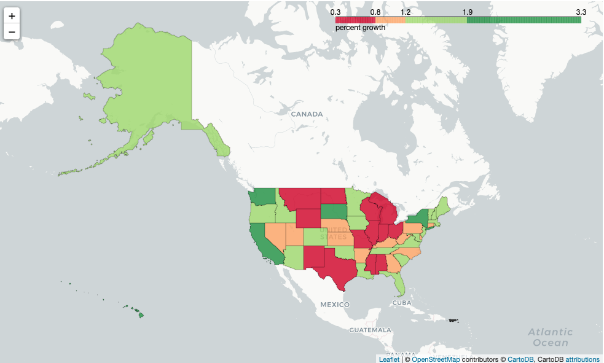

After inspection on the nations map, the targeted area to focus on is identified as New York City.  A similar analysis was performed on the zillow data set for the 5 boroughs of NYC.  Below is a map showing the overall growth of these boroughs from 1996 to 2018 and their trends:

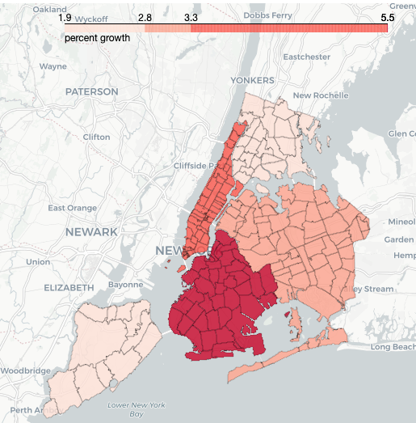

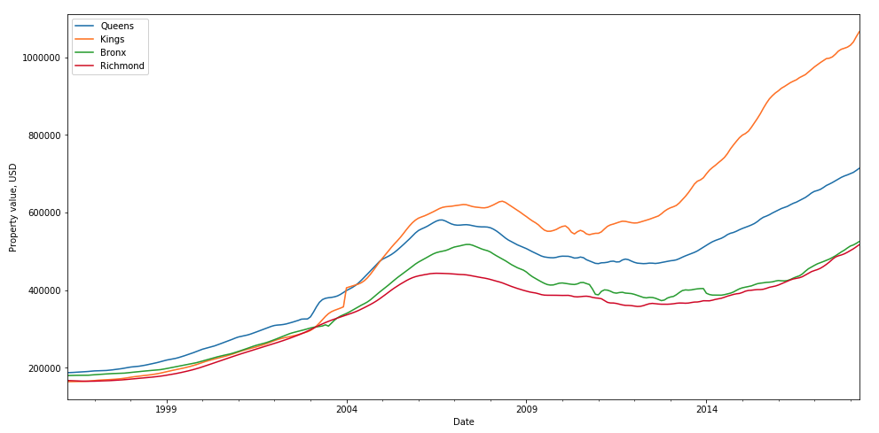

In order to identify which zip codes to target for the modeling process, the data is split from by borough to by zipcodes within the boroughs.  From the map below one may notice the following:
1.  Manhattan zip codes are limited with data.  Manhattan will be excluded from the analysis as it is typically over developed and very expensive.
2.  Locations around highly upcoming neighborhoods, such as near the Barclay have shown great growth.
3.  The areas of interest are those zipcodes just outside the zone of rapic growth.

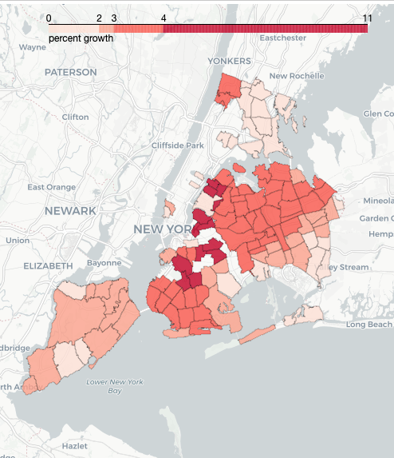

Targeted areas to invest in:

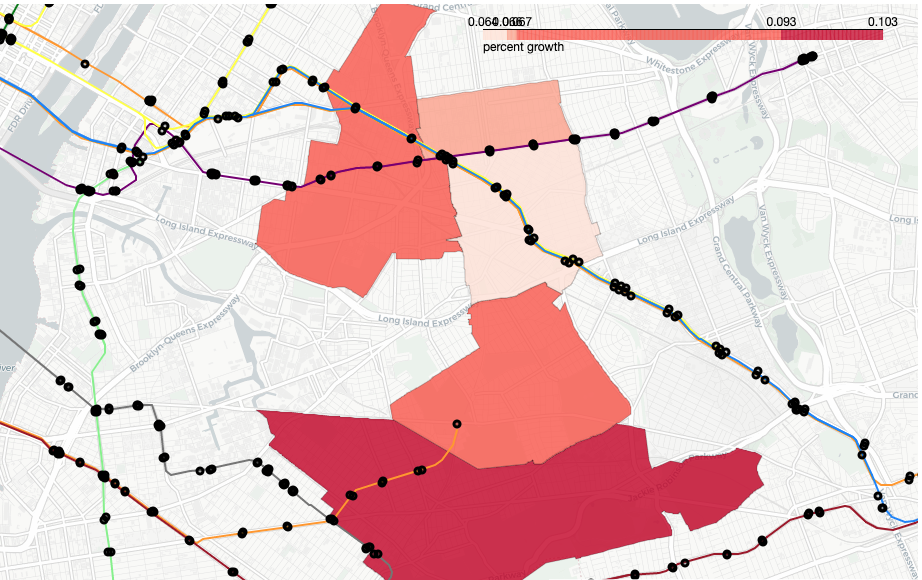

## Time series data inspection

The timeseries data must first be converted into a stationarity dataset.  A 2x difference is performed in order to achieve stationarity.

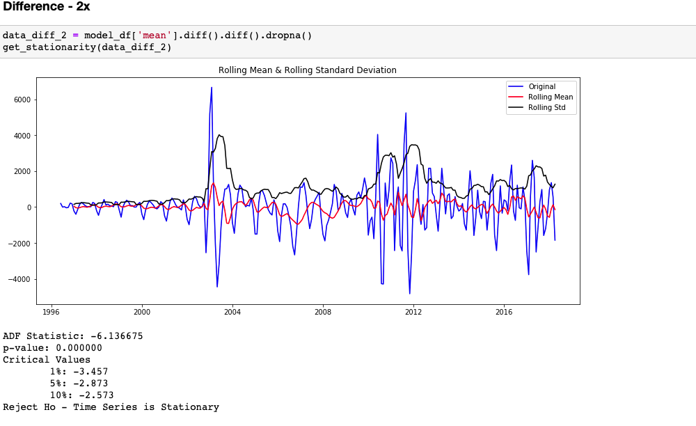

With the stationary dataset, the autocorrelation and partial autocorrelation functions are used to determind model parameters.

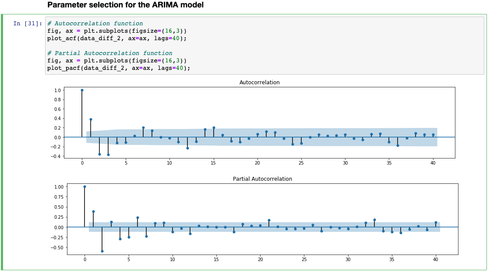

#### ARIMA Model

The order of the model can be ontained by inspection of the plots above, for a 2x difference (d = 2). The autocorrelation fucntion is used to determine p, from the trends the first value within the tollerance is 4. The partial autocorrelation fucntion is used to determine q, from the trends the first value within the tollerance is 3. There is no seasonality and therefore we set those terms to 0.

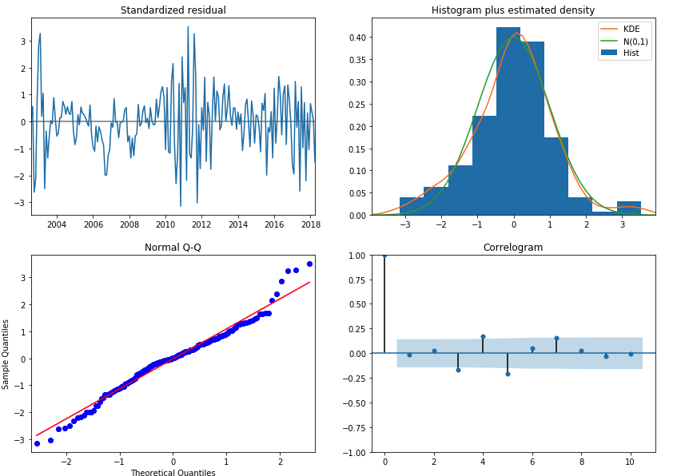

## Conclusion

The ARIMA model obtained for our time series analysis can now be used to predict values on our data as a means to evaluate the accuracy of the model.  From the trends below, one may notice the forcasted housing prices overlay the actual values, indicating the model fit accurately to the data.

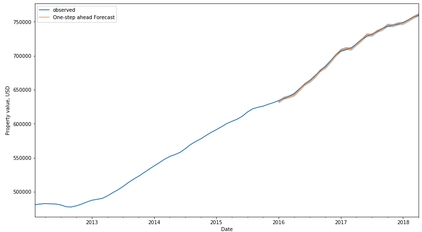

The ARIMA model can also be used to forecast future values beyond the time series time interval.  This is especially helpful to help identify an action one may take based on data.  In this case, on may notice, the forecasted results yield an 80% confidence shows an increasing property value over the course of the next 2 years.  Endorse investing in these targeted zip codes.

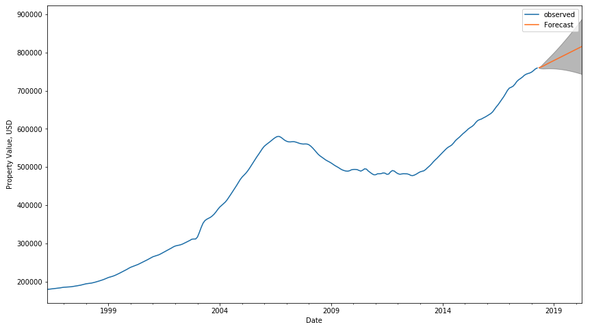

In this project, the ARIMA model was used to fit data to the time series of zillow housing prices.  Although, limited with limited data points, the model produced  favorable investment results with a high level of confidence.  

## Future Work

#### Improving model accuracy

Introducting external data to the dataset

* Incorporating future construction project into the model to predict how large-scale investments into an area can affect housing prices.
* Current dataset does not include how the COVID-19 has impacted the market, extend dataset to more recent timeframes for analysis.
* Adding additional external data to the model, ie number of permits issued by NYC DoB
 
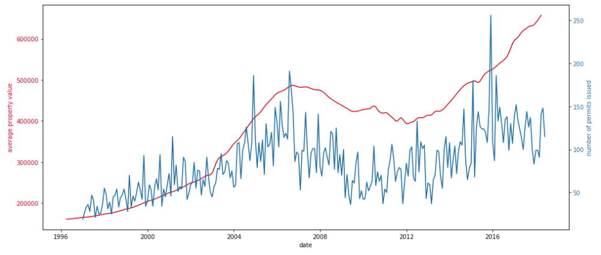

#### References
 1. Frej, Anne B; Peiser, Richard B. (2003). Professional Real Estate Development: The ULI Guide to the Business (2 ed.). Urban Land Institute. 

